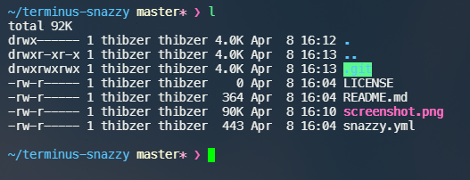

# Terminus-Snazzy

Elegant theme with bright colors for [Terminus](https://github.com/Eugeny/terminus) based on [Hyper-Snazzy](https://github.com/sindresorhus/hyper-snazzy)

## Install

Open *Terminus'* Config file (*Settings->Config File*), and paste the content of `snazzy.yaml` within `terminal` scope. 

Go to *Color Scheme* setting and select `Snazzy`.

## License

MIT © [ThibzR](https://github.com/ThibzR)